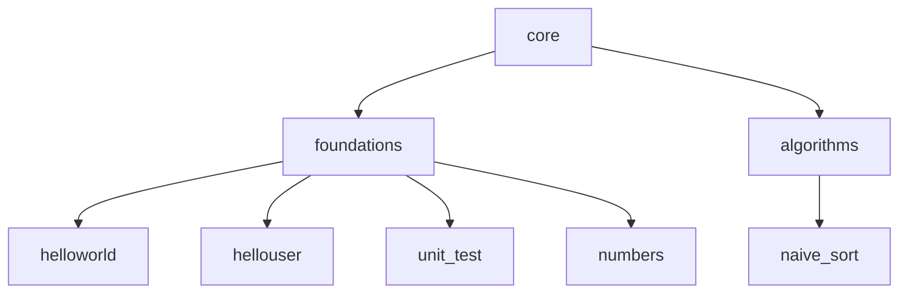

# Core — Elm

> **Proyectos fundamentales de Elm**

Directorio que agrupa los proyectos base organizados por nivel de dificultad. Contiene la carpeta [`foundations/`](foundations/), con los proyectos introductorios del lenguaje, y la carpeta [`algorithms/`](algorithms/), con los algoritmos puros de la Fase 1.

---

## 📂 Contenido

| Directorio | Descripción |
|------------|-------------|
| [`foundations/`](foundations/) | Proyectos fundamentales: Hello World, Hello User, Calculator, Numbers |
| [`algorithms/`](algorithms/) | Algoritmos puros: Naive Sort (selection, bubble, insertion) |

Cada proyecto incluye su propio `README.md` con instrucciones detalladas de compilación, ejecución y pruebas.

---

## 🚀 Siguiente nivel

---

*🌐 [github.com/yorche3/programming_languages](https://github.com/yorche3/programming_languages)*
