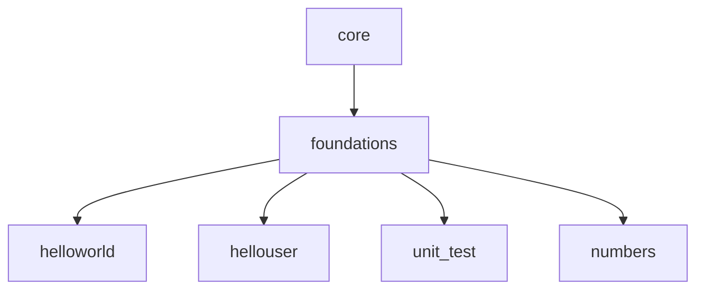

# Core — Elm

> **Proyectos fundamentales de Elm**

Directorio que agrupa los proyectos base organizados por nivel de dificultad. Actualmente contiene la carpeta [`foundations/`](foundations/), con los proyectos introductorios del lenguaje.

---

## 📂 Contenido

| Directorio | Descripción |
|------------|-------------|
| [`foundations/`](foundations/) | Proyectos fundamentales: Hello World, Hello User, Calculator, Numbers |

Cada proyecto incluye su propio `README.md` con instrucciones detalladas de compilación, ejecución y pruebas.

---

## 🚀 Siguiente nivel

---

*🌐 [github.com/yorche3/programming_languages](https://github.com/yorche3/programming_languages)*
