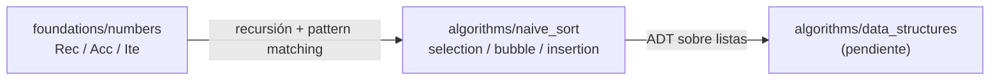

# Algorithms Pure — Elm

> **Core Algorithms · Elm 0.19.1**

Implementaciones de la [Fase 1 — Algoritmos Puros](https://yorche3.github.io/programming_languages/ROADMAP/#fase-1--algoritmos-puros--algorithms-pure-) en **Elm**: ordenamientos elementales, estructuras de datos propias, ordenamientos óptimos y distribuidos, y búsqueda.

Los módulos de esta fase trabajan sobre listas de Elm (`List Int`), que son inmutables: ningún algoritmo ordena *in-place*.

---

## 📂 Proyectos

| Proyecto | Especificación | Conceptos clave |
|----------|---------------|-----------------|
| [`naive_sort/`](naive_sort/) | [05_Naive_Sort](https://yorche3.github.io/programming_languages/core/algorithms/05_Naive_Sort/) | `case` + pattern matching sobre listas, recursión estructural, tuplas como retorno múltiple, privacidad vía `exposing`, `elm-test` |

---

## 🧭 Mapa de aprendizaje



| Paso | Proyecto | Aprendes |
|------|----------|----------|
| **1** | `naive_sort` | `case` con pattern matching sobre listas, recursión en lugar de bucles, bandera `swapped` devuelta como valor, privacidad declarada en `exposing` |

---

## 🛠️ Requisitos comunes

```bash
# Elm CLI
npm install -g elm

# elm-test (para ejecutar tests/)
npm install -g elm-test
```

---

## 🏗️ Conceptos de Elm demostrados

| Concepto | Proyecto | Descripción |
|----------|----------|-------------|
| Pattern matching sobre listas | `naive_sort` | `[]` y `first :: rest` separan casos base y recursivos |
| Recursión estructural | `naive_sort` | Sustituye a los bucles `for`/`while` del pseudocódigo |
| Tuplas como retorno múltiple | `naive_sort` | `(List Int, Bool)` devuelve la lista y la bandera `swapped` |
| Privacidad por `exposing` | `naive_sort` | Sólo las funciones del contrato son públicas |
| Anotaciones de tipo | `naive_sort` | `List Int -> List Int`, `Int -> List Int -> (Int, List Int)` |
| `elm-test` | `naive_sort` | `describe`, `test`, `Expect.equal`; 21 tests |

---

## 📁 Estructura general

```text
algorithms/
└── naive_sort/
    ├── elm.json
    ├── src/
    │   └── NaiveSort.elm
    ├── tests/
    │   └── NaiveSortTest.elm
    └── README.md
```

---

### 🌐 Otras implementaciones / Other implementations

Este proyecto también está implementado en otros lenguajes. Explora el [repositorio principal](https://github.com/yorche3/programming_languages) para ver todas las versiones.

---

## ▶️ Siguiente / Next

👉 Continúa con los módulos pendientes de esta fase en el [Roadmap](https://yorche3.github.io/programming_languages/ROADMAP/).
👉 Continue with the pending modules of this phase in the [Roadmap](https://yorche3.github.io/programming_languages/ROADMAP/).

---

*[← Volver a Core](../README.md)*

*🌐 [github.com/yorche3/programming_languages](https://github.com/yorche3/programming_languages) · [GitHub Pages](https://yorche3.github.io/programming_languages/)*
